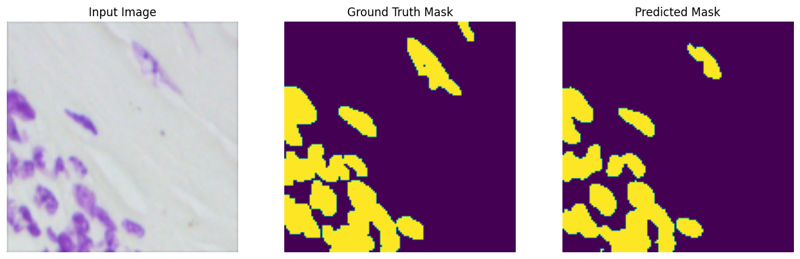
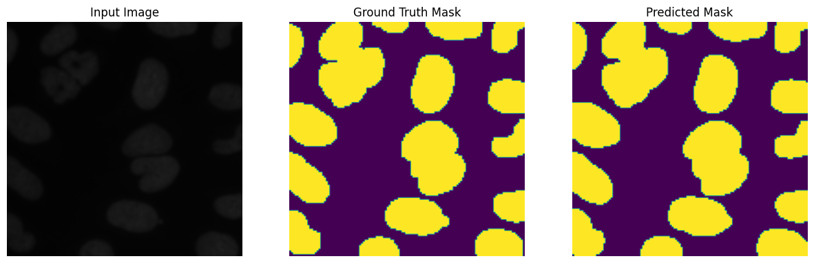
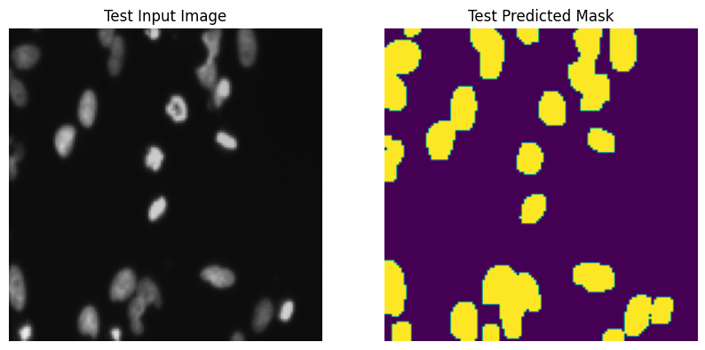

# Nuclei Segmentation with U-Net

This repository contains code for identifying nuclei in diverse images using U-Net, a popular neural network architecture for image segmentation.

## Problem Statement

The goal of this project is to find and segment nuclei in various images to advance medical discovery. Accurate segmentation of nuclei can aid in understanding and diagnosing various medical conditions. The dataset used for this project is the Data Science Bowl 2018 dataset, which is a popular dataset for nuclei segmentation tasks.

## Usage

To use the code and replicate the nuclei segmentation task, follow these steps:

1. Download the Data Science Bowl 2018 dataset.

2. Run the provided Jupyter notebooks to load the data, create and train the U-Net model, and perform predictions.

3. View the results in the `Results/` folder to visualize the model's segmentation performance.

## Dependencies

- Python 3.x
- TensorFlow
- Keras
- NumPy
- scikit-learn
- OpenCV
- Matplotlib

## Results

