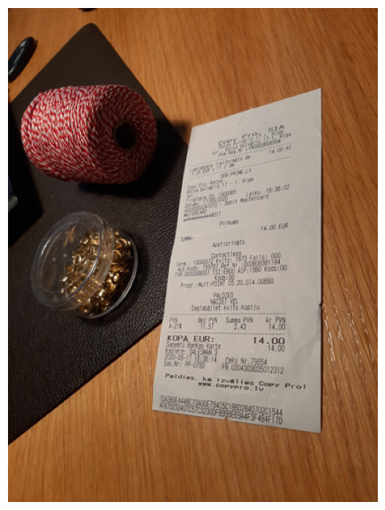
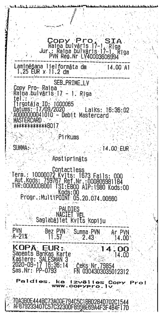

# Receipt Segmentation and Perspective Transformation

This project focuses on segmenting a receipt from an image, extracting it, and applying a perspective transformation to straighten the receipt for further processing.

## Overview

In this project, I use image processing techniques to achieve the following:

1. **Receipt Detection**: Identify and isolate the receipt within an input image.

2. **Perspective Transformation**: Apply perspective transformation to the receipt, making it flat and aligned.

3. **Thresholding**: Convert the transformed image to a binary format for OCR.

## Instructions

The project consists of the following major steps:

1. **Image Preprocessing**: I start by loading an image and preparing it for further processing. I resize the image, apply Gaussian blur, dilate, and perform edge detection to highlight contours.

2. **Contour Detection**: I detect contours in the processed image and draw them to visualize the areas of interest.

3. **Receipt Contour Identification**: The largest contour, likely representing the receipt, is identified and isolated.

4. **Perspective Transformation**: I calculate the perspective transformation to straighten the receipt.

5. **Thresholding**: After perspective transformation, I apply adaptive thresholding to the receipt, making it suitable for OCR.

6. **Display Result**: The final result is displayed, showing the segmented and transformed receipt.

## Dependencies

- Python
- OpenCV
- NumPy
- scikit-image
- Matplotlib

## Result

Original Image:

Segmented Image:

## Contributing

Contributions to this project are welcome. Feel free to submit pull requests or open issues for any improvements or bug fixes.
